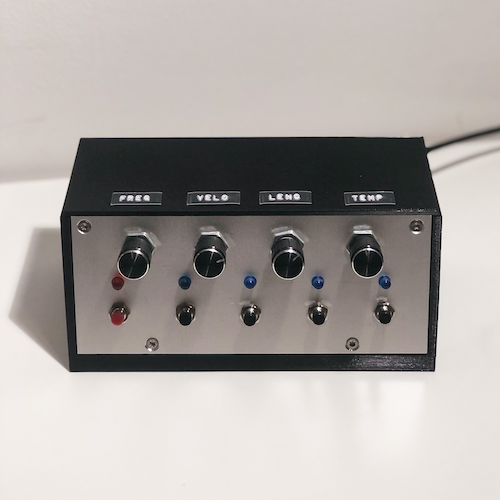
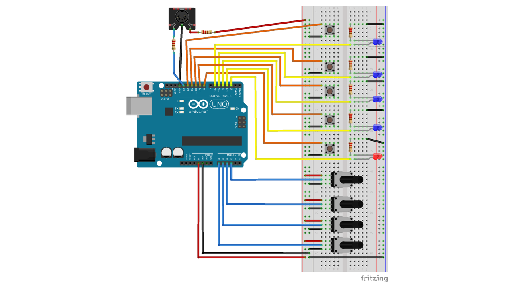
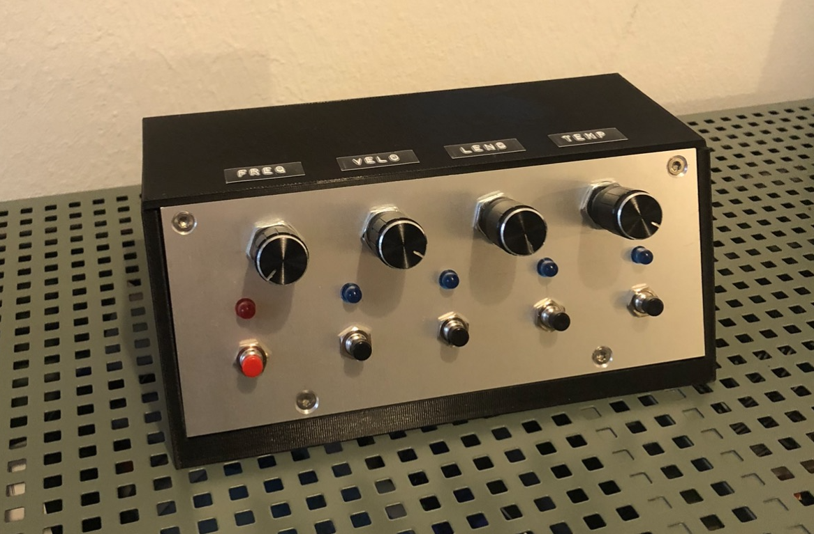
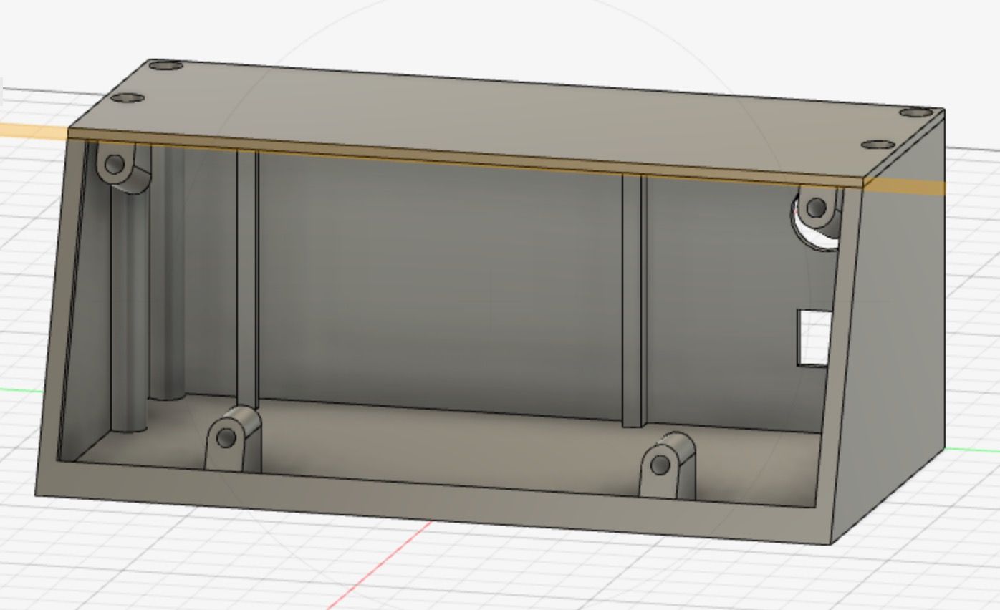

# Step Sequencer 



## Video 
A demo video of the step sequencer can be found on [YouTube](https://youtu.be/CwtGaaOoeo4).

## Features
The step sequencer allows you to create a repeating sequence of tones and to change the resulting tone sequence with 
the buttons and potentiometers. It supports the MIDI protocol and has a DIN connector. This allows you to use the step 
sequencer together with other instruments or use it as an input for software instruments in a Digital Audio 
Workstation (DAW). For the seccond approach you might need to use a MIDI to USB cable.  

The step sequencer has five buttons, five LEDs and four potentiometers. The first button is the start/stop button with 
which the step sequencer can be turned on and off. The LED above indicates the status. The other four buttons stand 
for the four tones of the tone sequence. When the step sequencer is turned on, all LEDs are lighted, which means that 
all tones are played. The individual tone buttons can be used to turn the individual tones on or off.

The tone sequence can be adjusted with the potentiometers. The different potentiometers have the following functions:
- `Frequency`: setting the tone frequency of all tones depending on the [MIDI note range](#midi-note-range)
- `Velocity`: setting how hard the note is struck
- `Length`: setting the length of the notes 
- `Tempo`: setting the tempo in [BPM](#bpm)

## Requirements

### Hardware / Materials

- Arduino [(Amazon)](https://www.amazon.de/gp/product/B008GRTSV6/ref=ppx_yo_dt_b_asin_title_o06_s01?ie=UTF8&psc=1)
- USB cable [(Amazon)](https://www.amazon.de/gp/product/B071RKJB6K/ref=ppx_yo_dt_b_asin_title_o06_s00?ie=UTF8&psc=1)
- 5x LEDs [(Amazon)](https://www.amazon.de/Leuchtdioden-Sortimentsk-Heimwerker-Wissenschafts-Erfahrung/dp/B08M66SK7B/ref=sr_1_3_sspa?__mk_de_DE=ÅMÅŽÕÑ&dchild=1&keywords=leuchtdiode&qid=1614010080&sr=8-3-spons&psc=1&spLa=ZW5jcnlwdGVkUXVhbGlmaWVyPUEzNUxSWjQ1R0g0QTM1JmVuY3J5cHRlZElkPUEwODM5MTg3MTVWQ1dBQU40NklDTSZlbmNyeXB0ZWRBZElkPUEwNDY1MDgxMVg5TkZSQ1BWQldIUSZ3aWRnZXROYW1lPXNwX2F0ZiZhY3Rpb249Y2xpY2tSZWRpcmVjdCZkb05vdExvZ0NsaWNrPXRydWU=)
- 5x Buttons [(Pollin)](https://www.pollin.de/p/miniatur-drucktaster-420320)
    :warning: when buying make sure to buy only NC (opener) or only NO (closer) contacts
- 4x Potentiometer [(Pollin)](https://www.pollin.de/p/potentiometer-omeg-pc20bu-10-ko-linear-240663)
    :warning: when buying make sure to buy only linear potentiometers
- 4x Rotary button [(Pollin)](https://www.pollin.de/p/aluminium-drehknopf-mit-zeigernase-15x18-mm-schwarz-410169)
- MIDI DIN port [(Reichelt)](https://www.reichelt.de/din-buchse-5-polig-hufeisenform-mab-5-p11171.html?CCOUNTRY=445&LANGUAGE=de&trstct=pos_0&nbc=1&&r=1)

:warning: Most of the parts listed are not breadboard compatible. If development with the breadboard is desired, take 
care to purchase the appropriate parts.

### Additional parts / tools:
- MIDI-USB cable [(Amazon)](https://www.amazon.de/gp/product/B07KYDP3GK/ref=ppx_yo_dt_b_asin_title_o03_s00?ie=UTF8&psc=1)
- Wires
- Connectors
- Resistors
- Copper strand
- Heat shrink tubing
- Soldering iron + solder

### Housing
- Filament for 3D-printer
- Remaining piece metal sheet
- Threaded bushings [(Amazon)](https://www.amazon.de/gp/product/B08BCRZZS3/ref=ppx_yo_dt_b_asin_title_o01_s00?ie=UTF8&psc=1)
- Screws [(Amazon)](https://www.amazon.de/gp/product/B0862G5HF8/ref=ppx_yo_dt_b_asin_title_o00_s00?ie=UTF8&psc=1)

### Software

The step sequencer we built is based on the AVR toolchain including: 
- [avr-gcc](https://gcc.gnu.org/wiki/avr-gcc)
- [avrdude](https://linux.die.net/man/1/avrdude)

These packages contain the libraries to write code for the Atmega chips. Besides that they provide command line 
interfaces to build your software and upload the result to your microcontroller.

On MacOs you can install `avr-gcc` and `avrdude` via [homebrew](https://brew.sh/):
```bash
$ brew install avr-gcc
$ brew install avrdude 
```

If you are using a linux distribution like Ubuntu that is based on Debian you can install the packages as common:
```bash
$ apt update && apt install -y gcc-avr && apt install -y avrdude
```

Besides this you can find a Docker image including all packages necessary to build avr-gcc projects. We used the image 
for building the project in a CI/CD pipeline. The image can be found on 
[Docker Hub](https://hub.docker.com/repository/docker/maxmerz/avr-gcc). The corresponding Dockerfile is located 
[here](/build-image/Dockerfile).

## Configuration
The step sequencer's configuration can be edited by adjusting the values of the `source/globals.h` file. Here you can 
change hardware related settings, like the used pins and sequencer specific configurations like the note ranges or BPM 
(beats per minute) settings. 

### BPM
If you want to change the BPM range for the tempo potentiometer you can do this by adjusting the `MIN_TEMPO_BPM` and 
`MAX_TEMPO_BPM` values. The maximum value the implementation supports is 600 BPM.

### MIDI note range
During our development process we recognized that not all software instruments support the whole range of MIDI notes. 
Due to this we decided to implement the possibility to edit the range of MIDI notes that will be played. If you want 
to change the minimum MIDI note number that the step sequencer supports you have to adjusts the value of the 
`MIN_NOTE_NUMBER` property. For the max MIDI note number the `MAX_NOTE_NUMBER` has to be adapted. For more 
information about the MIDI protocol click [here](http://www.music-software-development.com/midi-tutorial.html).

### Buttons, LEDs, potentiometers and the DIN jack (MIDI jack)
If you decide to change the pins for the buttons, leds, potentiometers or the DIN jack that will be used to transfer 
the MIDI messages you can modify the values in the `source/globals.h` as well. It's important that the buttons are 
connected to the same register, otherwise the implementation will not work. This can be applied to the LEDs and 
potentiometers. Here we want to mention that the potentiometer will have to be connected to pins that support the 
Arduinos built in ADC (analog digital converter).

### Build and Logging

#### USB port configuration
In the `source/makefile` you will have to configure the USB port your Arduino is connected to. On MacOS systems the 
right port is located at `/dev/tty.usbmodem*` or `/dev/tty.usbserial*`. On Linux it is `/dev/ttyUSB*` or 
`/dev/ttyACM*`. The port number is represented with `*`. To get a list of all connected USB devices execute the 
following command: 

```bash
$ ls -al /dev | grep tty
```
The output should look something like this: 

```bash
crw-rw-rw-   1 root            wheel           22,  12 Feb 17 15:34 tty.usbmodem14501
```

After finding out the right port, the `PORT` value of the `source/makefile` needs to be adjusted. In our example the 
`PORT` value would look like that:

```makefile
...
# Add used USB port here (e.g. /dev/ttyACM0)
PORT=/dev/tty.usbmodem14501
...
```

#### Reading Logs

If you want to debug the application you can use our logging library. For more information on how to write log 
messages take a look at the [Logging library](#logging-library). 

To read the transfered log data you will have to set the right baud rate for the used USB port. The baud rate can be 
read with the following commands. `<port>` is the USB port your Arduino is connected to (e.g. `/dev/tty.usbmodem14501`
or `/dev/ttyUSB123`).

MacOs:

```bash
$ stty -f <port>
```

Linux:

```bash
$ stty -F <port>
```

If the baud rate is `9600` you are fine. If not execute the following commands to set the baud rate.

```bash
$ stty -f <port> 9600
```

Linux:

```bash
$ stty -F <port> 9600
```

To read the logs, sent by the step sequecer you have to listen for messages on the corresponding port. On Linux systems 
this is possible with the `cat` command. On MacOS you can use the `screen` command. 

MacOs: (To leave press `ctl` + `a`, then `k` and then `y`)

```bash
$ screen <port>
```

Linux: (To leave press `ctl` + `c`)

```bash
$ cat <port>
```

## Installation Guide
The step sequencer's heart, the Arduino, will be flashed using the [Make](https://www.gnu.org/software/make/) 
toolchain. Therefore we created a corresponding makefile that is located at `source/makefile`.

Due to the logging functionality you have to configure your used USB port first. Therefore take a look into the 
[configuration chapter](#build-and-logging). Besides this you should navigate in the makefiles folder:
```bash
$ cd source
```

With the help of [Make](https://www.gnu.org/software/make/) we provide the following functionalities: 

* Flash the step sequencers source code to the Arduino (includes build, size and clean)
    ```bash 
    $ make flash
    ```
* Print size information for the programm and the data
    ```bash 
    $ make size
    ```
* Build the source code (includes size)
    ```bash 
    $ make build
    ```
* Delete the files that were created during the build 
    ```bash 
    $ make clean
    ```

## Circuit Diagram
Here you can see the breadboard diagram of our stepsequencer. For more details, please take a look at our [schematic view](circuit-diagrams/sequencer_schem.png).
Both circuit diagrams have been created with [Fritzing]("https://fritzing.org/").



## Housing



### Base plate 
All buttons, LEDs and potentiometers have to be mounted to a plate. In our case we used a metal one to guarantee 
stability. The plate's dimensions are 16,3 cm * 6,7 cm. Feel free to mount the parts wherever you want to but be aware 
of leaving enough space on the sides for the screws and the casing. We recommend 1 cm on each side.

To mount the plate to the casing you have to drill four holes. Two of them will have to be drilled to the longer bottom 
side of the base plate. They have to have a 0.5 cm gap to the longer side of the base plate and a 3.5 cm gap to the 
short side of the plate. The two holes in the top edges have to have a 0.7 cm gap to each side. 

### Casing



We created CAD drawings, to print the rest of the housing with a 3D-Printer. The drawings can be found in the 
repository's [`housing`](housing) folder. There are two .stl files:

- [stepsequencer_housing](housing/setpsequencer_housing.stl): The case where you screw the base plate on and that 
holds the Arduino
- [stepsequencer_top_cover](housing/setpsequencer_top_cover.stl): The housings top cover

Additionally we uploaded the files to [Thingiverse](https://www.thingiverse.com/thing:4773969).

## Implementation 
As we needed to implement different functionalities for our sequencer, we decided to create our own libraries and group 
them in a folder called `libs` which can be found in the `/source` directory. The functionality we implemented there is 
used in our main file which runs the sequencer. The following listing shows how our code is structured:

### Project Structure
* Librarys ([libs](/source/libs))
  * Logging library ([logger.c](source/libs/logger.c), [logger.h](source/libs/logger.h))
  * SUART library for sending MIDI messages 
  ([suart_midi.c](source/libs/suart_midi.c), [suart_midi.h](source/libs/suart_midi.h))
  * MIDI library ([midi.c](source/libs/midi.c), [midi.h](source/libs/midi.h))
  * Potetiometer library ([poti.c](source/libs/poti.c), [poti.h](source/libs/poti.h))
* Main file ([main.c](source/main.c))
* Button abstraction (([button.c](source/button.c), [button.h](source/button.h)))
* Global config file ([globals.h](source/globals.h))
* Build instructions ([makefile](source/makefile))

For details regarding globals and building our project with the makefile take a look at the 
[Configuration](#configuration) and the [Installation Guide](#installation-guide).

#### Logging library
The Logging library allows to send log messages via the serial USB port of your Arduino. Using this library is very 
easy. You just have to add the library to your project and you are ready to send log messages. The connection will be 
established on the first attempt.

Here is a small example on how to use the library:
```C
#include "libs/logger.h"
int main(){

    ...
    usb_log("Hello I am a debugging message\n");
	...
}
```

If you want to read the log messages take a look at the [reading logs chapter](#reading-logs).

#### SUART library for sending MIDI messages
The Arduino Uno has one hardware component, that is called UART. This is using the Tx/Rx pins to transmit data via 
the USB port. In our case the USB port is already in use for sending debug messages. Therefore, in order to send MIDI 
messages to the computer, we implemented a software UART (SUART). 

The SUART library is the base on which we built the MIDI library. This library takes the MIDI messages and sends it to 
the MIDI jack using the right configuration specified by the MIDI protocol. 

This library consists of three functions which will be further explained in the following.

##### `void suart_midi_init()`
As the name of the function already describes, the SUART library is initialized here. Since UART is an asynchronous 
communication, the sender and receiver must use the same baud rate. That way the receiver knows in which clock it must 
sample the line, in order to be able to read the message correctly. In this case the baud rate indicates how many bits 
per second are sent. For MIDI there is a fixed baud rate of 31250. To be able to send in this rate the timer0 is used 
in CTC (Clear Time on Compare) mode. This means that the timer value is incremented with every cycle of the CPU 
(16MHz) until it matches the compare register. Then the timer is set to zero again and an interrupt 
`ISR(TIMER0_COMPA_vect)` is triggered.

Furthermore, in this function the pin over which the data is transmitted is declared as output pin and the line is set 
to high in idle state. In addition, the variable `outframe` is declared, which is later used to store the message to 
be sent.

##### `void suart_put_byte(const uint8_t dataByte)`
This function is called to send a byte which is passed as a parameter. This byte represents a MIDI message. If at 
moment of the funciton call the transmission of another byte is still running, we have to wait. After that the byte to 
be sent is written into the `outframe` variable, and the start/stop bits are added. After this the message will be 
converted to its final structure. 

Finally, the timer count value is reset to ensure that no value from a previous transmission is still stored in this 
register. Then the timer0 is activated to send the message.

##### `ISR(TIMER0_COMPA_vect)`
The actual sending of the message takes place in the interrupt function of timer0. Every time the function is triggered 
the first bit of the message stored in the `outframe` variable will be sent. After this the sent bit will be removed 
from the `outframe` variable. This process is repeated until all bits from the outframe have been sent. If this 
happened the timer is deactivated and the transmission of the message is successfully completed.

#### MIDI library
The MIDI library is used to send MIDI messages. To use this library the method `init_midi(MidiChannel ch)` needs to be 
called. In this method the MIDI channel is set and the underlying 
[SUART library](#suart_library_for_sending_midi_messages) is initialized. The library is used to send the actual bytes 
of a MIDI message. Additionally the MIDI library contains the following methods:

##### `void set_midi_channel(MidiChannel ch)`
The MIDI channel is set when the MIDI library is initialized. If you want to change the MIDI channel at any time this 
method can be used. As parameter this method accepts a value of the `MidiChannel` enum.

##### `void send_midi_note_on(MidiNote *note)`
This method takes a `MidiNote` pointer as parameter which is a custom declared struct which has all parameters that 
are necessary to send a MIDI message. The struct looks as follows: 

```c 
typedef struct {
    // Midi note number (0 - 127)
    uint8_t number;
    // Midi note velocity (0 - 127)
    uint8_t velocity;
    // After *length* time ticks, note_off has to be sent 
    uint8_t length; 
} MidiNote;
```
This method calls the internal method `void send_midi_note(MidiMessageType type, MidiNote *note)` for sending a MIDI 
message via the suart library. In the parameters `type` specifies whether a note-on or a note-off MIDI message is sent 
and the pointer `MidiNote` contains information about which note should be played with which velocity.

##### `void send_midi_note_off(MidiNote *note)`
This method works the same as the previously described method. With the only difference that in this case a note-off 
message is sent.

#### Potentiometer library
The potentiometer library can be used to read the values of potentiometers using the Arduino's built in analog digital 
converter (ADC). The library has to get initialized by calling the `init_poti_adc(uint8_t pin)` method. After this you 
can read the power level of the pin that is connected to the potentiometer. The function that reads the analog values 
is called `adc_read_poti(uint8_t pin)`. If you want to execute the method, you have to pass the pin of the Arduino 
where your potentiometer is connected to. The pins you can use are A0 to A5 but while we are using the avr-gcc 
toolchain you have to pass P0 to P5. After measuring the input power of the potentiometer the method returns a value 
between 0 and 1023.

During our development process we realized that there might happen inaccuracy during the measurement. Due to this 
we implemented another method to calculate the average from 64 reads. The method is called 
`get_poti_average(uint8_t pin)`.

Here is a short example on how to use the library: 
```c
#include "globals.h"
#include "libs/poti.h"
int main(){
    init_poti_adc();

    resultPotiFrquency = get_poti_average(POTI_FREQUENCY);

    // Do something
}
```

If you are more interested in ADC and how to use it with the avr-gcc toolchain take a closer look at 
[this](http://maxembedded.com/2011/06/the-adc-of-the-avr/) article. 

#### Button abstraction
To declutter the [main.c](source/main.c) we decided to outsource the logic for reading the buttons into its own file. 
The [button.c](source/button.c) implements two methods, `init_button_ports_mcu()` and `button_pressed()`. The 
`init_button_ports_mcu()` function has to be executed to initialize the pins the buttons are connected to. If you want 
to learn more about the configuration of the buttons take a closer look at the [Configuration](#Configuration) chapter.

The `button_pressed()` method can be used can be used to check if a button was pressed. The method returns 1 if the 
button was pressed, else 0 is returned. The method takes two arguments. The first one is the pin the button is 
connected to. The second one indicates if the button is an opener or a closer. If your button is from type closer you 
will have to pass 0, otherwise 1.

If you want to read a button the code would look like that: 

```c
#include "globals.h"
#include "buttons.h"
int main(){
    init_button_ports_mcu();

    if(button_pressed(BUTTON_START_STOP, 0)){

        // Do something, the button was pressed 
    
    }
}
```
Due to button debouncing you should lock the button read for a specific time. In our case we wait for six ticks before 
reading the button again. To understand what we mean with ticks you can take a closer look at the 
[Implementation Details chapter](#implementation_details).

### Implementation Details
The core functionality of our sequencer is to play all notes repeatedly in sequence.
To achieve that, we make use of a `timer`(specifically `Timer1`). 
It is programmed to call an interrupt routine in a fixed defined frequency and
decreases a variable repeatedly to 0, which is the event when the next note can be played. 
As our sequencer also allows to modify the beats per minute and note length,
we also implemented counters for that. The general concept behind our counters is that
they are continuously counted down by the interrupt routine and if they reach 0,
a specific event occurs. After that, the counter value is updated and the process repeats.

All counters are members of a struct called `SequencerState` (defined in [main.c](source/main.c)). 
This struct is instanciated only once in our program and holds all variables related to general sequencer information.

In the following we will explain how notes are continuously sent at the right time with respect to the tempo (BPM) 
which is controlled by a potentiometer. This should give you a better understanding of our counters.

#### Detailed Example
The `SequencerState` instance has a variable `tempoTicks` which holds the number of ticks 
(interrupts which trigger the interrupt routine) that are needed until the next note can be sent. 
Its value is updated when the potentiometer that is used to controll the tempo is being turned. 
The functionality to read values from the potentiometer and convert them to their digital equivalent is implemented 
in our [poti library](source/libs/poti.c). The method calculating the amount of ticks needed, also takes the 
configuration of minimum and maximum BPM into consideration.

The counter used to trigger a send-note-event is named `tempoTicksCounter`. It is set to the value of the `tempoTicks`
variable and is then decreased by the interrupt routine, until it reaches 0. When it reaches 0, the next note will be 
sent. After that the value is set to the current value of the `tempoTicks` variable and the process repeats.

The condition to send a note is constantly monitored inside the main loop of our program (`main.c:main()`) and when 
it is detected (`tempoTicksCounter == 0`), the note is sent.

####  Sending Notes
Sending notes and controlling their length is implemented by our [MIDI library](source/libs/midi.c). 
This library provides two methods for this purpose. They are called `send_midi_note_on()` and `send_midi_note_off()`. 
This is necessary because the MIDI protocol is working with messages that indicate the beginning and the ending of a 
note. If you press a key on a MIDI keyboard a NOTE_ON for this note will be sent. If you release the key the 
NOTE_OFF MIDI message will be send. The time between the NOTE_ON and NOTE_OFF message is the length of our note. 
For more information about the MIDI protocol click [here](http://www.music-software-development.com/midi-tutorial.html).

Both methods require a pointer to a `MidiNote` instance (defined in [midi.h](source/libs/midi.h)). 
`MidiNote` is a struct which holds all information needed by a MIDI note (e.g.: note number and velocity).
The MIDI message is constructed by the method `sendMidiNote()` and consists of three parts (three times one byte). 
Those bytes are send to our MIDI/USB output with our software UART implementation which is another one of our libraries
and can be found [here](source/libs/suart_midi.c).
This library internally also uses a timer (`Timer0`) to send the bytes (in single bits) with the correct baude rate 
(31250 for MIDI)

This section gave an overview of the most important implementation and architecture details.
For more details see the comments in our source code.
